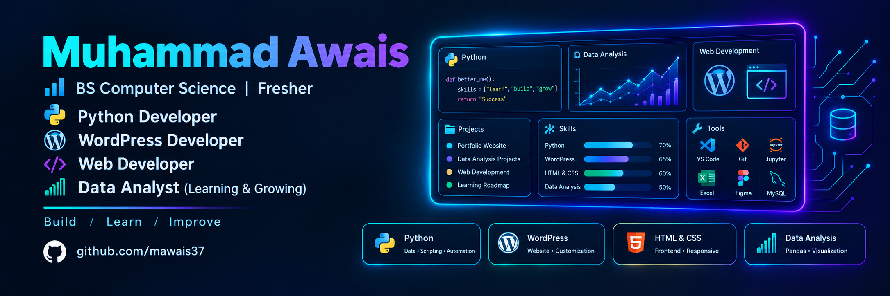

# Hi, I'm Muhammad Awais 👋

### 🐍 Python Developer • 🌐 WordPress Developer • 📊 Data Analyst • 🤖 AI/ML Enthusiast


---

# 👨‍💻 About Me

I am an aspiring **Python Developer and AI/ML learner** with a background in **WordPress development and freelancing**, passionate about programming, data analysis, machine learning, and building practical technology solutions.

I enjoy working with **Python, data, and emerging AI technologies** while continuously improving my programming, analytical, and problem-solving skills.

My goal is to build a strong foundation in **Machine Learning and Artificial Intelligence** through hands-on projects, internships, and continuous learning.

### 🔎 Areas I'm Interested In

- 🐍 Python Development
- 🤖 Artificial Intelligence
- 🧠 Machine Learning
- 📊 Data Handling with NumPy & Pandas
- 🌳 Classification Models (Decision Trees)
- 🌐 WordPress Development

---

# 💻 Tech Stack


---

# 🚀 Current Focus

- 🐍 Strengthening Python programming
- 📊 Learning data handling with NumPy & Pandas
- 🧠 Learning Machine Learning algorithms
- 🌳 Practicing classification with Decision Trees
- 🤖 Exploring Artificial Intelligence fundamentals
- 🔧 Improving Git & GitHub workflow

---

# 🤖 AI/ML Journey

I am building my skills across the machine learning workflow:

### 📥 Data Handling

- Working with datasets
- CSV file handling
- Basic data cleaning
- Array operations with NumPy

### 🧹 Data Preprocessing

- Handling missing values
- Data transformation
- Preparing datasets for training

### 🧠 Machine Learning

Currently developing knowledge of:

- Classification
- Decision Tree Classifiers
- Train/Test Splitting
- Model Evaluation

### 🤖 Artificial Intelligence

Exploring:

- AI fundamentals
- Machine Learning concepts
- Applied AI systems

---

# 📂 Featured Projects

*Adding my Python and ML projects here as I complete them.*

---

# 💼 Technical Skills

### 🐍 Programming

- Python
- Data Structures
- Problem Solving

### 📊 Data Science

- Pandas
- NumPy
- Basic Data Cleaning
- Data Analysis & Visualization

### 🤖 Machine Learning

- ML Fundamentals
- Classification
- Decision Trees
- Model Training
- Model Evaluation
- Scikit-learn

### 🌐 Web Development

- WordPress Development
- HTML & CSS
- Freelance Client Projects

### 🛠️ Development Tools

- Git
- GitHub
- VS Code
- Excel

---

# 🌱 Currently Learning

- 🐍 Advanced Python
- 📊 Data Handling with NumPy & Pandas
- 🌳 Machine Learning Algorithms (Classification, Decision Trees)
- 🤖 Applied AI/ML Fundamentals
- 🚀 Real-World AI/ML Projects

---

# 🎯 Career Objective

My long-term goal is to become a skilled **Python Developer and AI / Machine Learning professional** capable of building practical, data-driven solutions.

I want to continuously improve my knowledge of:

**Python → Data Handling → Machine Learning → Artificial Intelligence**

I am interested in opportunities where I can:

- Build real-world AI/ML projects
- Work with meaningful datasets
- Solve technical problems
- Learn from experienced professionals
- Continue growing as a technology professional

---

# 📚 Learning Roadmap

```
Python
   ↓
NumPy + Pandas
   ↓
Data Handling & Cleaning
   ↓
Machine Learning Fundamentals
   ↓
Classification (Decision Trees)
   ↓
Model Evaluation
   ↓
Artificial Intelligence
   ↓
Real-World AI/ML Projects
```

---

# 🏆 Highlights

- 🐍 Python Developer & Learner
- 🤖 AI & Machine Learning Learner
- 🧠 Machine Learning Fundamentals
- 🌐 WordPress Development & Freelancing Background
- 📊 Data Analysis Basics
- 💻 Building practical projects
- 🔧 Git & GitHub
- 🌱 Continuously learning and improving

---

# 📊 GitHub Stats


---

# 🤝 Let's Connect

[](https://github.com/mawais37)

---

# 💬 Personal Motto

> **"Build. Learn. Improve."**

---

⭐ **Thanks for visiting my GitHub profile!**

### 🐍 Python | 🤖 AI | 🧠 Machine Learning | 🌐 WordPress | 📊 Data Analysis | 🚀 Continuous Learning
